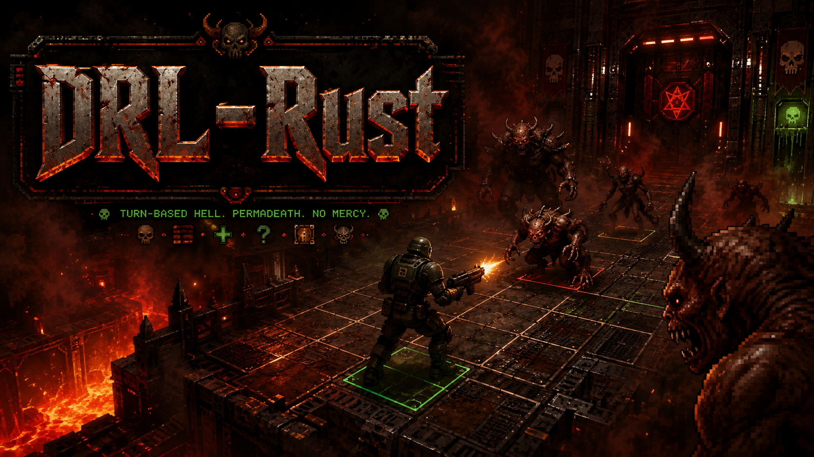

# DRL-Rust

(Note this is not an actual gameplay.)

**DRL-Rust** (`drl-rust`) is a ground-up Rust reimplementation of [Doom the Roguelike (DRL)](https://drl.chaosforge.org/), initially targeting a high-quality native macOS experience.

- [Legacy codebase fork](https://github.com/SaehwanPark/doom-the-roughlike-original)
- Assume the fork is cloned locally at `../doom-the-roughlike-original` along with sound/music assets `../doom-the-roughlike-original/drlhq/` (extracted from the release binary [as instructed by the original developer](https://github.com/chaosforgeorg/drl/blob/master/README.md)) and [fpcvalkyrie](https://github.com/chaosforgeorg/fpcvalkyrie) into `../doom-the-roughlike-original/fpcvalkyrie/`
- Assume Lua is installed via Homebrew (`brew install lua`)

## Initial Project Documents

- [Proposal](docs/DRL-Rust_Project_Proposal.md)
- [Roadmap](docs/DRL-Rust_Project_Roadmap.md)
