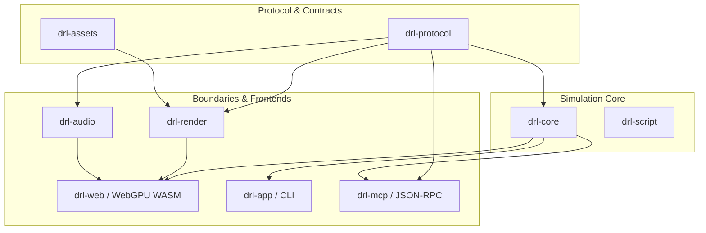

# Determinism & Architecture

**drl-rs** is engineered with a strict **Functional Core, Imperative Shell** architecture. Simulation logic is completely decoupled from presentation, GPU shaders, audio mixers, operating system APIs, and network protocols.

---

## 🏛️ Workspace Architecture

The repository is organized into focused, single-responsibility Cargo crates:

---

## 🔑 Core Architectural Guarantees

### 1. Functional Simulation Core (`drl-core`)
- **No Ambient State**: Zero global static variables, thread-local storage, or wall-clock timestamps.
- **Pure PRNG**: All stochastic decisions flow through an explicit, seedable `GameRng` instance utilizing rejection sampling across the full `u32` integer domain without modulo bias.
- **No I/O**: `drl-core` and `drl-protocol` do not import `std::fs`, `std::net`, `wgpu`, or DOM bindings.

### 2. Transaction Atomicity & Command Safety
Every state-mutating command submitted to `Game::step()` is wrapped in a transactional guard:
- **Validate First**: Pre-flight checks verify preconditions (valid coordinates, available ammunition, equipped weapon state).
- **Prepare & Rollback**: If validation fails or an error occurs mid-execution, the transaction guard rolls back the `World`, scheduler, and RNG states to the exact pre-command snapshot.
- **Invariant**: `Err => before == after`.

### 3. Separation of Presentation & Simulation
`drl-render` constructs pure, platform-neutral presentation models (sprite layers, lighting bands, emissive highlights, UI projection rectangles) without executing graphics draw calls. The browser crate (`drl-web`) translates these plans into WebGPU render passes.

### 4. Bit-Exact Replay Reproducibility
Every session can emit a canonical `drl-rs-replay-v2` JSON envelope. Playing back these commands on any platform (macOS, Linux, Windows, WASM) produces the exact same game state, turns, damages, kills, and outcomes.
