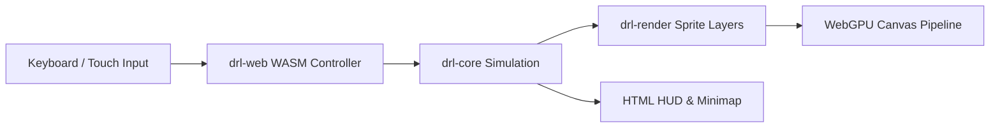

# WebGPU Browser Edition

The browser edition of **drl-rs** compiles the entire deterministic simulation engine to WebAssembly (WASM) and renders high-performance pixel-art graphics using native WebGPU shaders in desktop Chromium browsers (Google Chrome, Microsoft Edge, Brave, Opera).

---

## 🖥️ System Requirements & Support

- **Browser**: Desktop Google Chrome 113+ or Microsoft Edge 113+ with WebGPU support enabled.
- **Display**: High-DPI and standard display monitors. The game automatically letterboxes into a square pixel-perfect aspect ratio.
- **Hardware Acceleration**: WebGPU-compatible GPU backend (Metal on macOS, Direct3D 12 on Windows, Vulkan on Linux).

> [!NOTE]
> WebGPU is required for GPU accelerated sprite composition, dynamic lighting bands, and emissive overlays. When running in environments without WebGPU, the diagnostic banner will report capability status.

---

## 🎮 Interface & Interactive Controls

The browser interface provides a dual-layer interface: an interactive WebGPU `<canvas>` alongside a fully accessible HTML DOM shell.

### Top Action Bar
- **Start Game**: Initializes WebGPU context and unlocks audio playback on first user gesture.
- **Restart**: Restarts the session with the initial seed.
- **Save / Load**: Saves game state to browser `localStorage` and restores on demand.
- **Clear Save**: Opens a modal confirmation dialog to safely wipe quarantined or saved session tokens.
- **Mute / Volume**: Controls procedural Web Audio sound cues and master gain.

### Head-Up Display (HUD)
- **HP**: Real-time hit points and maximum health cap.
- **Turn**: Current turn counter.
- **Weapon**: Equipped weapon name, loaded ammo count, and maximum magazine capacity.
- **Target Indicator**: Shows active target name, health state, and range.
- **Minimap**: High-contrast text/ASCII explored map projection for quick orientation and screen readers.

---

## 📴 Offline PWA & Service Worker Support

The web bundle registers a Progressive Web App (PWA) Service Worker:

1. **Precached Assets**: WASM binary, sprite atlases, shader modules, HTML, and audio cues are cached locally upon first visit.
2. **Offline Play**: Once installed, you can launch and play the game completely offline without an active internet connection.
3. **Signed Release Manifests**: Every release bundle includes a cryptographic `release-manifest.json` verifying asset integrity and preventing corrupted cache poisoning.
