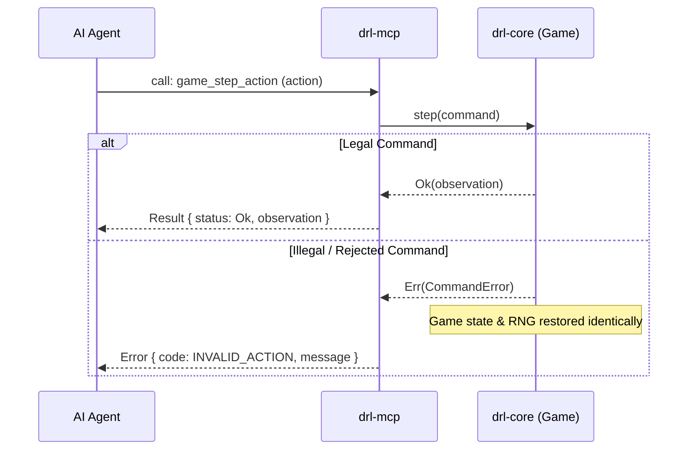

# AI & MCP Playtesting Guide

**drl-rs** provides a first-class [Model Context Protocol (MCP)](https://modelcontextprotocol.io/) server built directly into `drl-mcp`. This enables AI coding agents (Claude, Antigravity, custom LLM bots) to observe, play, test, and evaluate the game through structured JSON-RPC 2.0 tools and resources.

---

## 🤖 Starting the MCP Server

The MCP server runs over standard I/O (stdio) transport:

```bash
cargo run -p drl-app --bin drl-rs -- --mcp
```

### Example MCP Host Configuration
Add **drl-rs** to your agent's MCP configuration (`mcp_settings.json` or `claude_desktop_config.json`):

```json
{
  "mcpServers": {
    "drl-rs": {
      "command": "cargo",
      "args": ["run", "-q", "-p", "drl-app", "--bin", "drl-rs", "--", "--mcp"]
    }
  }
}
```

---

## 🛠️ MCP Tool Catalog

The server exposes semantic, state-safe tools to interacting agents:

| Tool Name | Parameters | Description |
|---|---|---|
| `game_start` | `seed`, `width`, `height` | Initializes a new procedural dungeon session with seed. |
| `game_list_actions` | none | Returns a list of strictly legal actions for the current turn. |
| `game_step_action` | `action`, parameters... | Executes a semantic action (`move`, `fire`, `aimed_fire`, `reload`, `pickup`, `use`, `equip`, `unequip`, `drop`, `descend`, `wait`). |
| `game_get_observation`| none | Returns fair `PlayerObservation` (explored map, FOV, visible entities, HUD status). |
| `game_get_metrics` | none | Returns telemetry metrics (HP, damage dealt/taken, kills, turns survived). |
| `game_load_scenario` | `scenario_id` | Loads a predefined vertical test scenario (combat, inventory, unique items). |
| `game_save_replay` | none | Emits a canonical `drl-rs-replay-v2` JSON envelope of the session. |
| `game_verify_replay` | `replay` | Read-only verification of a replay envelope, ensuring bit-exact determinism. |
| `game_reset` | none | Resets the active session. |

---

## 🔒 Transaction Safety & Determinism Invariant

Every tool call in **drl-rs** adheres to strict transactional safety:



If an agent attempts an illegal action (e.g. firing with an empty magazine, equipping an invalid item, stepping into a wall), the command is rejected atomically:
- Turn count does **not** advance.
- PRNG state is **not** consumed.
- World and player entities remain completely unchanged (`before == after`).

---

## 📋 Sample Agent Prompt Recipe

When prompting an autonomous AI agent to play **drl-rs**, use this prompt pattern:

```markdown
You are an autonomous playtesting agent playing drl-rs.
1. Call `game_start` with seed 42 to initialize the dungeon.
2. Call `game_get_observation` to inspect your surroundings and identify visible threats.
3. Call `game_list_actions` to query legal moves.
4. Pick high-value actions:
   - Pick up ammunition and weapons.
   - Fire at visible demons when in range.
   - Step into doorways to prevent swarm attacks.
   - Stand on stairs and call `descend` to complete levels.
5. Save your replay with `game_save_replay` and verify reproducibility with `game_verify_replay`.
   The resulting canonical `drl-rs-replay-v2` JSON can also be checked outside
   an MCP session with `cargo run -p drl-app --bin drl-rs -- replay verify replay.json`,
   or with `cargo run -p drl-app --bin drl-rs -- replay verify -` when piping
   the JSON on standard input. The command accepts only the current V2
   envelope; the CLI enforces the exact canonical format and bounded input;
   migration and cross-version replay interchange remain unsupported.
```
