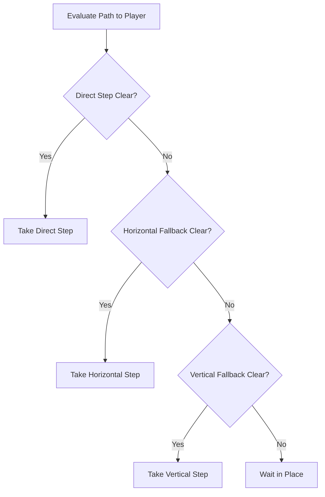

# Monsters & Combat Tactics

Surviving the depths in **drl-rs** requires understanding demonic behavior patterns, energy speed discrepancies, and situational battlefield tactics.

---

## 👹 Demonic Bestiary

| Demon Archetype | HP | Speed | Attack Type | Threat & Behavior |
|---|---|---|---|---|
| **Former Human** | Low | 100 | Ranged (Pistol) | Basic zombified infantry. Drops 9mm ammo upon defeat. |
| **Former Sergeant** | Med | 100 | Ranged (Shotgun) | Dangerous in close quarters. Fires shotgun blasts that inflict knockback on the player. |
| **Imp** | Med | 100 | Ranged Fireball / Melee | Hurls fiery projectiles from range; switches to clawing when cornered. |
| **Pinky Demon** | High | 140 | Melee (Bite) | Rapid predator. Moves 40% faster than standard speed, closing distances swiftly. |
| **Cacodemon** | High | 100 | Ranged Ball Lightning | Flying horror. Discharges high-voltage lightning plasma orbs. |
| **Baron of Hell** | Very High | 100 | Heavy Green Plasma | Elite demonic commander. Endures heavy punishment and deals massive damage. |
| **Revenant** | High | 100 | Guided Homing Missiles | Skeletal warrior equipped with shoulder-mounted missile pods. |

---

## 🧠 AI Movement & Fallback Rules

Demonic AI in **drl-rs** executes a deterministic four-tier movement candidate fallback hierarchy:

1. **Direct Preferred Step**: Attempts to move directly along the shortest geometric vector to the player.
2. **Raw Retry**: If the ideal angle is blocked, checks the secondary diagonal candidate.
3. **Horizontal Fallback**: Tries stepping purely horizontally towards the player's X coordinate.
4. **Vertical Fallback**: Tries stepping purely vertically towards the player's Y coordinate.
5. **Wait / Hold**: If all directional candidates are obstructed, the monster holds position rather than wandering aimlessly.

---

## 💡 Tactical Survival Principles

### 1. Doorway & Choke Point Control
Never fight hordes in open arenas. Retreat behind doorways and single-tile corridors. In narrow passages, enemies are forced to approach one by one, rendering swarming tactics ineffective.

### 2. Shotgun Spacing & Kinetic Knockback
Against fast melee enemies like Pinky Demons, utilize shotgun knockback. Each shotgun blast displaces the demon 1 tile away, resetting their melee range and buying precious time to fire another round.

### 3. Corner-Peeking & Line of Sight
Monsters cannot attack without direct line of sight. By stepping around a corner, you break target lock, forcing enemies to waste turns walking into your pre-aimed line of fire.

### 4. Ammunition Conservation
Save heavy explosive ordnance (rockets, BFG cells) for dangerous clusters of Barons and Revenants. Use sidearms and combat shotguns for basic infantry and stragglers.
