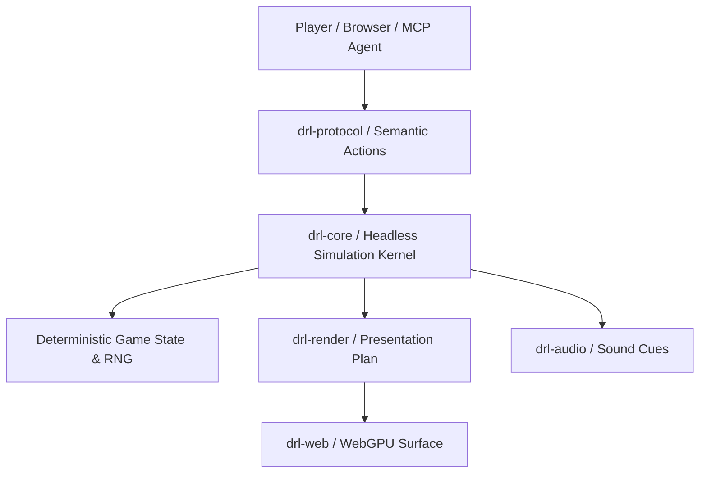

# DRL-rs Documentation Portal

Welcome to the player manual, tactical guides, and developer reference for **drl-rs**, a deterministic, ground-up Rust reimplementation of *Doom the Roguelike (DRL)*.

**drl-rs** combines classic tactical roguelike gameplay with modern software engineering guarantees: bit-exact determinism, transactional command safety, headless headless simulation architecture, Model Context Protocol (MCP) AI test harnesses, and a high-performance WebGPU browser edition.



---

## ⚡ Quickstart: Play in 60 Seconds

drl-rs can be experienced directly in your web browser, in the terminal, or controlled via automated AI agents.

### 1. 🖥️ WebGPU Browser Edition
Run the local static server and launch the WebGPU browser playable slice:
```bash
sh scripts/serve-web.sh
```
Open your browser at `http://127.0.0.1:8000` (tested on Chromium-based browsers with WebGPU enabled).

### 2. ⌨️ Terminal & Headless CLI
Run the standalone executable for interactive demos and batch procedural cohort studies:
```bash
# Run headless demo suite
cargo run -p drl-app --bin drl-rs

# Run deterministic procedural cohort study
cargo run -p drl-app --bin drl-rs -- cohort --episodes 100 --bot greedy
```

### 3. 🤖 AI Agent via Model Context Protocol (MCP)
Start the stdio JSON-RPC MCP server to allow AI assistants (Claude, Antigravity, or custom agents) to play and evaluate scenarios:
```bash
cargo run -p drl-app --bin drl-rs -- --mcp
```

---

## 📚 Player Manuals & Guides Directory

Explore our curated documentation sections:

### 🚀 Getting Started & Play
- [**Installation & Launch Guide**]({{ '/guides/installation.html' | relative_url }}): Setup Rust, compile from source, launch CLI tools, and build WASM artifacts.
- [**How to Play & Controls**]({{ '/guides/how-to-play.html' | relative_url }}): Movement, line-of-sight, ranged aiming, single-shell/magazine reloads, melee bump-attacks, and dungeon stairs descent.
- [**WebGPU Browser Edition**]({{ '/guides/browser-slice.html' | relative_url }}): Browser controls, touch/gamepad options, offline PWA caching, and audio cues.

### 🧠 Tactics, Weapons & Monsters
- [**Weapons & Items Catalog**]({{ '/guides/weapons-and-items.html' | relative_url }}): Weapon classes, ammo types, firing costs, shotgun knockback mechanics, power/bulk mod packs, protective armors, and exotic unique items (Trigun, Subtle Knife, Grammaton, BFG9000).
- [**Monsters & Combat Tactics**]({{ '/guides/monsters-and-tactics.html' | relative_url }}): Enemy speed ratios, alertness, AI candidate fallbacks, doorway choke points, and survivability advice.

### 🤖 AI, Automation & Testing
- [**AI & MCP Playtesting Guide**]({{ '/guides/mcp-playtesting-guide.html' | relative_url }}): Connect autonomous agents via standard JSON-RPC tools (`step`, `observe`, `reset`, `verify_replay`), run automated bots, and verify replay determinism.

### 🏗️ Engineering & Contribution
- [**Contributor Overview**]({{ '/README.html' | relative_url }}): Workspace layout, coding standards (Rust 2024), formatting, and regression check scripts.
- [**Determinism & ECS Core Architecture**]({{ '/guides/architecture-and-determinism.html' | relative_url }}): Headless architecture, transaction guards, functional core/imperative shell design, and WebGPU presentation boundaries.
- [**Asset Licensing Policy**]({{ '/reference/asset-licensing.html' | relative_url }}): Legacy asset provenance, rights boundaries, and redistribution clearance.
- [**Versioning Policy**]({{ '/reference/versioning.html' | relative_url }}): Semantic `x.y.z` release and PR version verification policy.
